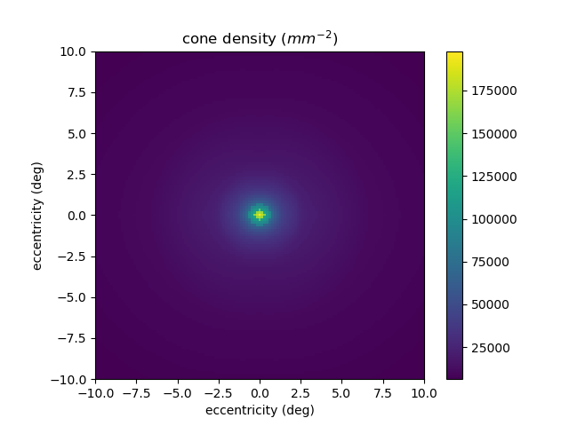

# cone_density

A simple tool for interpolating cone photoreceptor density in the human retina. Using data from Curcio et al.'s 1990 paper *Human photoreceptor topography*.

To use, download and unzip the directory somewhere in your python path. Then, to estimate the cone density and row spacing at a given eccentricity, instantiate a `ConeDensityInterpolator` object and call its `get_density_and_rowspacing` function on the target x- and y-coordinates, specified in degrees of visual angle. The function returns a 2-tuple, `(density, row_spacing)`, where density is cone density in **mm<sup>-2</sup>** and row_spacing is in **m**.

```python
from cone_density import ConeDensityInterpolator
cdi = ConeDensityInterpolator()
nasal_5_deg = -5
inferior_3_deg = 3.0
nasal_5_deg = -5.0
density,row_spacing = cdi.get_density_and_rowspacing(nasal_5_deg,inferior_3_deg)
print density # outputs 13302.348128 (cones/mm^2)
print row_spacing # outputs 8.06861314705e-06 (m)
print row_spacing*1e6 # outputs 8.0686131470546094 (um)
# To test the interpolator by computing all the densities
# and row_spacings over a 20x20 deg region and plotting them,
# run the test() method (or use 'python __init__.py' at the command line):
cdi.test()
```

## Some conventions:

1. Nasal and superior eccentricities are specified with negative values, while temporal and inferior eccentricities are specified with positive ones.

2. The original paper gives densities in (**mm<sup>-2</sup>**) as a function of **mm**. The `get_density_and_rowspacing` function takes eccentricity in degrees and converts to **mm** using a factor of **300 &mu;m/deg**.

[Curcio, Christine A., et al. "Human photoreceptor topography." *Journal of Comparative Neurology* 292.4 (1990): 497-523.](https://www.ncbi.nlm.nih.gov/pubmed/2324310)

## Maps of cone density and row spacing generated by `ConeDensityInterpolator.test()`:




## Interconversion of cone diameter and density


